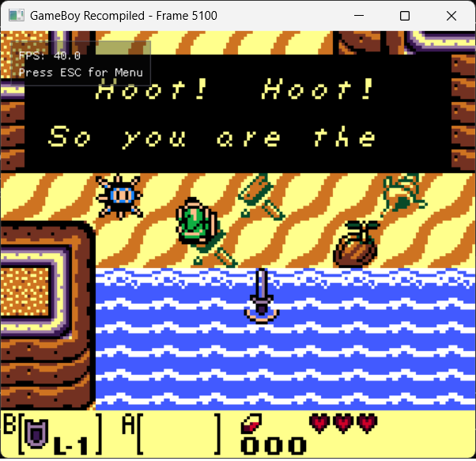
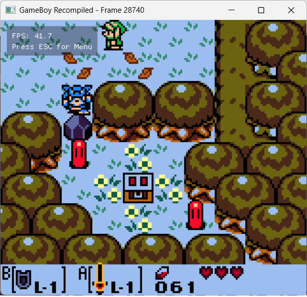
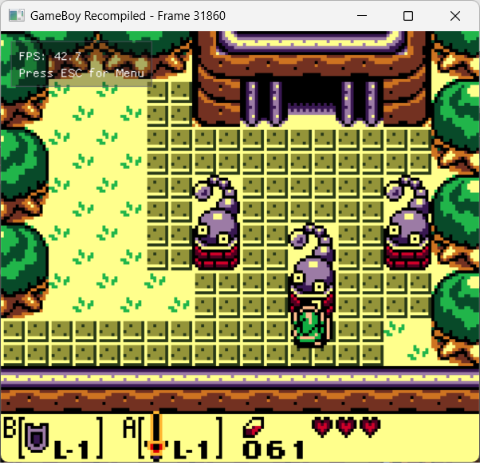
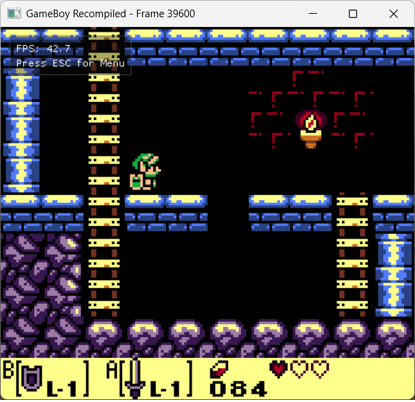

# Link's Awakening DX - Static Recompilation

A static recompilation of *The Legend of Zelda: Link's Awakening DX* (Game Boy Color) into a native Windows application. The game logic runs as compiled C code — no emulator or ROM interpretation at runtime.

## Screenshots

| Title Screen | File Select | Owl Dialogue |
|-------------|-------------|--------------|
|  |  |  |

| Mysterious Forest | Tail Cave | Side-Scrolling |
|-------------------|-----------|----------------|
|  |  |  |

## Current Status

**Completely playable.** Tested through the first dungeon (Tail Cave) with no game-breaking issues. Full intro sequence, title screen, file select, name entry, save/load, overworld exploration, NPC dialogue, and dungeon crawling all work.

Uses [gb-recompiled](https://github.com/arcanite24/gb-recompiled) to statically recompile the LA DX ROM into 4.2M lines of C with 17,805 functions. Full runtime with PPU, APU, and interpreter fallback.

### Working Features

- Full GBC color support — CGB detection, palette RAM, VRAM bank switching, HDMA
- PPU renders with CGB tile attributes: per-tile palette, VRAM bank, X/Y flip, BG priority
- CGB sprite rendering with OAM palette and VRAM bank selection
- CGB double-speed mode (KEY1 toggle)
- 4-channel audio with APU synthesis (pulse x2, wave, noise)
- Rain intro renders in full color with animated ocean waves
- File select with name entry — saves persist to SRAM
- Game loads into Marin's house with dialogue working
- 222 unresolved JP HL instructions handled by interpreter fallback

### Critical Recompiler Bugs Fixed

Three codegen bugs in gb-recompiled were found and fixed during this project:

1. **(HL) ALU codegen** — All ALU ops with `(HL)` operand (OR/AND/XOR/CP/ADD/ADC/SUB/SBC) emitted register B instead of `gb_read8(ctx, ctx->hl)`. ~5000 wrong instructions across the ROM.
2. **STORE8 union aliasing** — Immediate store instructions (`LD (HL),$xx`) could misidentify the source as a register due to union aliasing between `imm8` and `reg8` fields. Caused bank corruption and VRAM crashes.
3. **MBC5 bank range clamping** — Added `new_bank % max_bank` to prevent out-of-bounds ROM reads from invalid bank values.

### Debug Tracing Infrastructure

- SameBoy-based headless reference tracer captures per-scanline PPU state
- Matching trace output from recompiled build via `--hw-trace` flag
- Python comparison tool diffs traces to find exact divergence points
- Dispatch trace ring buffer for crash diagnosis

## How It Works

The original Game Boy ROM is statically recompiled into C:

1. **ROM Analysis** — The recompiler disassembles the ROM, identifies functions, and builds a call graph
2. **Code Generation** — SM83 assembly instructions translated to equivalent C code (17,805 functions)
3. **GB Runtime** — Lightweight runtime provides CPU registers, memory mapping, MBC5 bank switching, CGB hardware
4. **Interpreter Fallback** — Unresolved indirect jumps (JP HL) fall back to a cycle-accurate interpreter
5. **Hardware Abstraction** — PPU (scanline renderer with CGB support), APU (4-channel audio), input via SDL2

```
┌──────────────────────────────────────┐
│        Windows Application           │
│  SDL2 Window │ ImGui Debug │ Audio   │
├──────────────────────────────────────┤
│   Recompiled Game Code (64 banks)    │
│     17,805 functions from ROM        │
├──────────────────────────────────────┤
│          GB Runtime Library          │
│   Registers │ Memory │ Bank Switch   │
│   CGB Palettes │ VRAM Banking │ HDMA │
├──────────────────────────────────────┤
│       Hardware Abstraction           │
│   PPU/SDL2 │ APU/SDL2 │ Input/SDL2  │
└──────────────────────────────────────┘
```

## Building

Prerequisites: MSYS2 with MinGW64, CMake 3.16+, SDL2, Ninja

```bash
# Build
PATH="/c/msys64/mingw64/bin:$PATH" cmake --build build

# Run
PATH="/c/msys64/mingw64/bin:$PATH" ./build/rom.exe

# Run with hardware trace
./build/rom.exe --hw-trace trace.log --limit 10000000
```

### Debug Tracing Tools

```bash
# Build SameBoy reference tracer
cd tools
PATH="/c/msys64/mingw64/bin:$PATH" cmake -G Ninja -B build && ninja -C build

# Capture reference trace (300 frames)
./build/sb_tracer.exe --rom game.gbc --trace ref.log --frames 300

# Capture recompiled trace
cd ..
./build/rom.exe --hw-trace recomp.log --limit 10000000

# Compare
py tools/compare_hw_trace.py ref.log recomp.log
```

### Controls

| Game Boy | Keyboard | Xbox Controller |
|----------|----------|-----------------|
| D-pad    | Arrow keys / WASD | D-pad / Left stick |
| A        | Z / J    | A               |
| B        | X / K    | B               |
| Start    | Enter    | Start / Y       |
| Select   | Right Shift / Backspace | Back / X |

**Saving:** The game saves with A+B+Start+Select (the original Game Boy combo). On a controller, press **A+B+X+Y** instead — X and Y are mapped to Select and Start by default.

All keyboard and gamepad bindings can be customized from the **Controller > Controller Settings** menu. Bindings persist to `bindings.cfg` next to the executable.

## Project Structure

```
├── rom.c                  # 4.2M lines recompiled game code (Git LFS)
├── rom.h                  # Generated function declarations
├── rom_rom.c              # ROM data as C array
├── rom_main.c             # Entry point with --hw-trace support
├── CMakeLists.txt         # Build configuration
└── tools/                 # Debug tracing tools
    ├── sb_tracer.c        # SameBoy headless reference tracer
    ├── compare_hw_trace.py # Trace comparison tool
    └── README.md          # Tool documentation
```

The [gb-recompiled](https://github.com/sp00nznet/gb-recompiled) runtime lives in a separate repo and provides the core GB hardware emulation (PPU, APU, memory, CGB registers, interpreter fallback).

## Technical Details

- **ROM**: Link's Awakening DX (GBC, 1MB, 64 banks), MBC5 mapper
- **CPU**: SM83 instructions recompiled to C functions
- **PPU**: Scanline renderer with full CGB support (8 BG palettes, 8 OBJ palettes, VRAM banking, tile attributes)
- **APU**: 2x pulse, 1x wave, 1x noise channels at 44.1kHz
- **DMA**: OAM DMA + CGB HDMA (general-purpose and HBlank modes)
- **Display**: 160x144 scaled via SDL2 with ImGui debug overlay

### CGB Features Implemented

| Feature | Register(s) | Status |
|---------|-------------|--------|
| CGB Detection | A=0x11 at boot | Working |
| BG Palette RAM | FF68 BCPS, FF69 BCPD | Working |
| OBJ Palette RAM | FF6A OCPS, FF6B OCPD | Working |
| VRAM Bank Switch | FF4F VBK | Working |
| WRAM Bank Switch | FF70 SVBK | Working |
| General-Purpose DMA | FF51-FF55 | Working |
| HBlank DMA | FF55 bit 7 | Working |
| BG Map Attributes | VRAM bank 1 | Working |
| OBJ VRAM Bank | OAM bit 3 | Working |
| OBJ CGB Palette | OAM bits 0-2 | Working |
| Double Speed | FF4D KEY1 | Working |

### Known Limitations

- 222 JP HL instructions fall through to interpreter (functional but slower)
- Audio has minor crackling (APU timing or buffer underrun)

## Credits

- Game: Nintendo / Grezzo
- Disassembly: [LADX-Disassembly](https://github.com/zladx/LADX-Disassembly) contributors
- Recompiler: [gb-recompiled](https://github.com/arcanite24/gb-recompiled) by arcanite24
- Reference emulator: [SameBoy](https://github.com/LIJI32/SameBoy) by LIJI32
- This project is for educational and preservation purposes

## License

This project does not include any copyrighted game data. You must supply your own legally obtained ROM.
