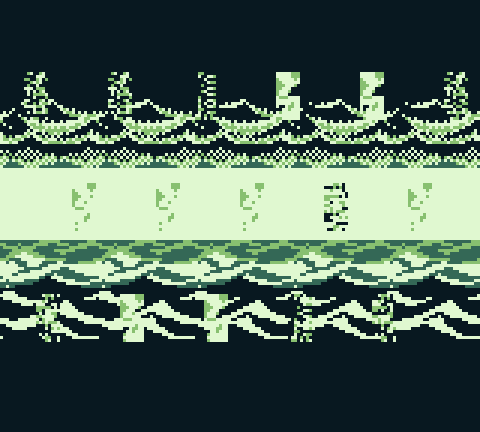
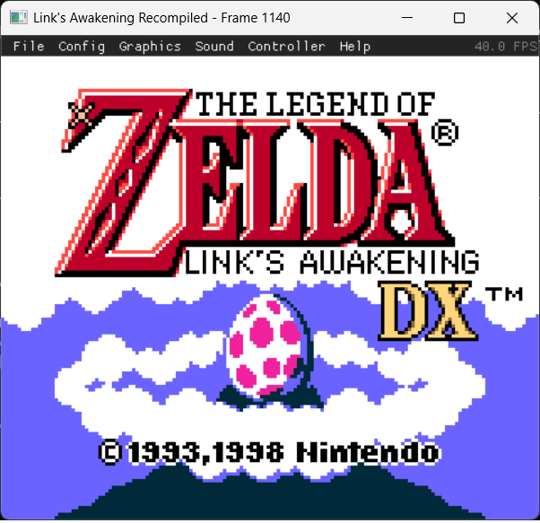
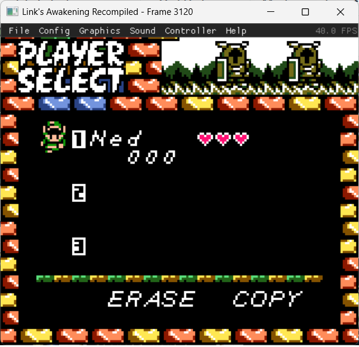
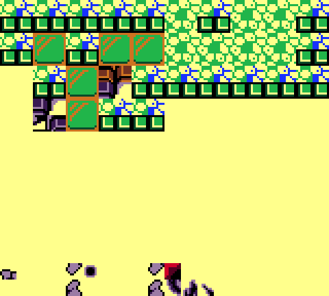

# Link's Awakening - Static Recompilation

A static recompilation of *The Legend of Zelda: Link's Awakening DX* (Game Boy Color) into a native Windows application. The game logic runs as compiled C code — no emulator or ROM interpretation at runtime.

## Screenshots

| Intro | Title Screen | File Select | Gameplay |
|-------|-------------|-------------|----------|
|  |  |  |  |

## Current Status

**Work in progress.** Two build paths exist — the original custom transpilation (this repo) and a newer gb-recompiled integration (see below).

### gb-recompiled Build (Primary — `D:/la-dx-recompiled/`)

Uses [gb-recompiled](https://github.com/arcanite24/gb-recompiled) to statically recompile the LA DX ROM into 4.2M lines of C with 17,805 functions. Full runtime with PPU, APU, and interpreter fallback.

**Recent milestones:**
- Full GBC color support — CGB detection (A=0x11), palette RAM (BCPS/BCPD/OCPS/OCPD), VRAM bank switching, HDMA
- PPU renders with CGB tile attributes: per-tile palette, VRAM bank, X/Y flip, BG priority
- CGB sprite rendering with OAM palette and VRAM bank selection
- 4-channel audio with APU synthesis
- Rain intro renders in full color with animated ocean waves
- 222 unresolved JP HL instructions handled by interpreter fallback

**Debug tracing infrastructure:**
- SameBoy-based headless reference tracer captures per-scanline PPU state, CGB palettes, VRAM/OAM checksums
- Matching trace output from recompiled build via `--hw-trace` flag
- Python comparison tool diffs traces to find exact divergence points
- First comparison identified: palette init timing (~16 frame lag), STAT register mode differences, OBP0/OBP1 init values (fixed)

### Original Custom Transpilation (This Repo)

- 11,251 functions transpiled from SM83 assembly to C across 32 bank files
- Full intro sequence, title screen, file select, and gameplay running
- Entity handler dispatch — 230+ entity behavior handlers
- STAT interrupt support for mid-frame scroll register changes
- See commit history for detailed bug fixes

## How It Works

The original Game Boy ROM is statically recompiled into C:

1. **ROM Data Extraction** — The ROM is sliced into 16KB banks and embedded as C arrays
2. **Assembly Transpilation** — SM83 assembly instructions translated to equivalent C code
3. **GB Runtime** — Lightweight runtime provides CPU registers, memory mapping, MBC5 bank switching
4. **Hardware Abstraction** — PPU (scanline renderer with CGB support), APU (4-channel audio), input via SDL2

```
┌──────────────────────────────────────┐
│        Windows Application           │
│  SDL2 Window │ ImGui Debug │ Audio   │
├──────────────────────────────────────┤
│   Recompiled Game Code (64 banks)    │
│     17,805 functions from ROM        │
├──────────────────────────────────────┤
│          GB Runtime Library          │
│   Registers │ Memory │ Bank Switch   │
│   CGB Palettes │ VRAM Banking │ HDMA │
├──────────────────────────────────────┤
│       Hardware Abstraction           │
│   PPU/SDL2 │ APU/SDL2 │ Input/SDL2  │
├──────────────────────────────────────┤
│       Debug Tracing Tools            │
│ SameBoy Ref │ HW Trace │ Comparator │
└──────────────────────────────────────┘
```

## Building

### gb-recompiled Build (Recommended)

Prerequisites: MSYS2 with MinGW64, CMake 3.16+, SDL2, Ninja

```bash
# Build the recompiled game
cd D:/la-dx-recompiled
PATH="/c/msys64/mingw64/bin:$PATH" ninja -C build

# Run
PATH="/c/msys64/mingw64/bin:$PATH" ./build/rom.exe

# Run with hardware trace
./build/rom.exe --hw-trace trace.log --limit 10000000
```

### Debug Tracing Tools

```bash
# Build SameBoy reference tracer
cd D:/la-dx-recompiled/tools
PATH="/c/msys64/mingw64/bin:$PATH" cmake -G Ninja -B build && ninja -C build

# Capture reference trace (300 frames)
./build/sb_tracer.exe --rom game.gbc --trace ref.log --frames 300

# Capture recompiled trace
cd D:/la-dx-recompiled
./build/rom.exe --hw-trace recomp.log --limit 10000000

# Compare
python3 tools/compare_hw_trace.py ref.log recomp.log
```

### Original Custom Build

```bash
cd D:/linksawakening-win
PATH="/c/msys64/mingw64/bin:$PATH" cmake --build build
```

### Controls

| Game Boy | Keyboard | Xbox Controller |
|----------|----------|-----------------|
| D-pad    | Arrow keys | D-pad / Left stick |
| A        | Z        | A               |
| B        | X        | B               |
| Start    | Enter    | Start           |
| Select   | Right Shift | Back         |

## Project Structure

```
D:/linksawakening-win/         # Original custom transpilation
├── src/                       # Core engine (gb_runtime, gb_ppu, gb_apu, etc.)
├── game/                      # Transpiled game code (32 banks, 11,251 functions)
└── tools/                     # Transpiler scripts

D:/la-dx-recompiled/           # gb-recompiled output
├── rom.c                      # 4.2M lines recompiled game code
├── rom_main.c                 # Entry point with --hw-trace support
└── tools/                     # Debug tracing tools
    ├── sb_tracer.c            # SameBoy headless reference tracer
    ├── compare_hw_trace.py    # Trace comparison tool
    └── README.md              # Tool documentation

D:/gb-recompiled/              # Recompiler + runtime (fork of arcanite24/gb-recompiled)
└── runtime/
    ├── src/gbrt.c             # Core runtime (CGB register routing, memory access)
    ├── src/ppu.c              # PPU with full CGB support
    ├── src/hwtrace.c          # Hardware trace output module
    ├── src/audio.c            # APU synthesis
    └── include/               # Headers (gbrt.h, ppu.h, hwtrace.h)
```

## Technical Details

- **ROM**: Link's Awakening DX (GBC, 1MB, 64 banks), MBC5 mapper
- **CPU**: SM83 instructions recompiled to C functions
- **PPU**: Scanline renderer with full CGB support (8 BG palettes, 8 OBJ palettes, VRAM banking, tile attributes)
- **APU**: 2x pulse, 1x wave, 1x noise channels at 44.1kHz
- **DMA**: OAM DMA + CGB HDMA (general-purpose and HBlank modes)
- **Display**: 160x144 scaled via SDL2 with ImGui debug overlay

### CGB Features Implemented

| Feature | Register(s) | Status |
|---------|-------------|--------|
| CGB Detection | A=0x11 at boot | Working |
| BG Palette RAM | FF68 BCPS, FF69 BCPD | Working |
| OBJ Palette RAM | FF6A OCPS, FF6B OCPD | Working |
| VRAM Bank Switch | FF4F VBK | Working |
| WRAM Bank Switch | FF70 SVBK | Working |
| General-Purpose DMA | FF51-FF55 | Working |
| HBlank DMA | FF55 bit 7 | Working |
| BG Map Attributes | VRAM bank 1 | Working |
| OBJ VRAM Bank | OAM bit 3 | Working |
| OBJ CGB Palette | OAM bits 0-2 | Working |
| Double Speed | FF4D KEY1 | Not yet |

### Known Limitations

- Game initialization ~16 frames behind reference emulator (timing difference)
- CGB double-speed mode not implemented
- 222 JP HL instructions fall through to interpreter (functional but slower)
- Audio has minor crackling (APU timing or buffer underrun)

## Credits

- Game: Nintendo / Grezzo
- Disassembly: [LADX-Disassembly](https://github.com/zladx/LADX-Disassembly) contributors
- Recompiler: [gb-recompiled](https://github.com/arcanite24/gb-recompiled) by arcanite24
- Reference emulator: [SameBoy](https://github.com/LIJI32/SameBoy) by LIJI32
- This project is for educational and preservation purposes

## License

This project does not include any copyrighted game data. You must supply your own legally obtained ROM.
